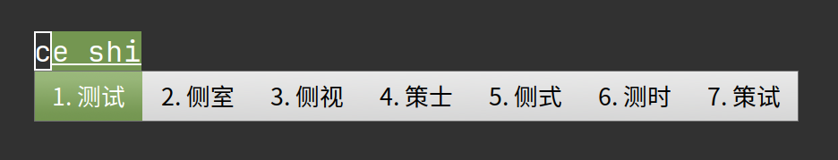
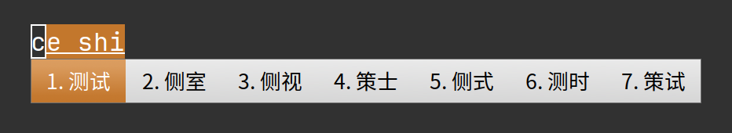
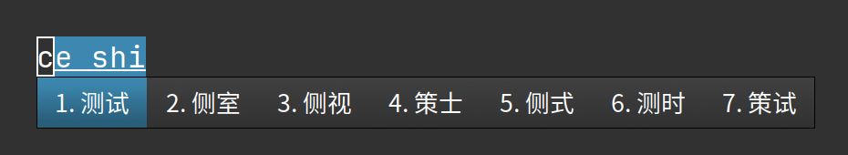
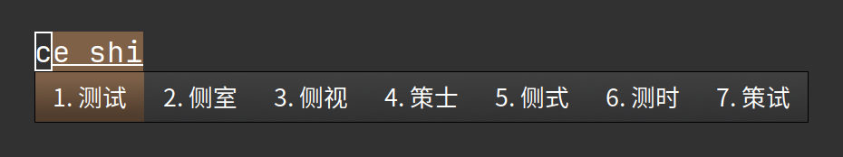
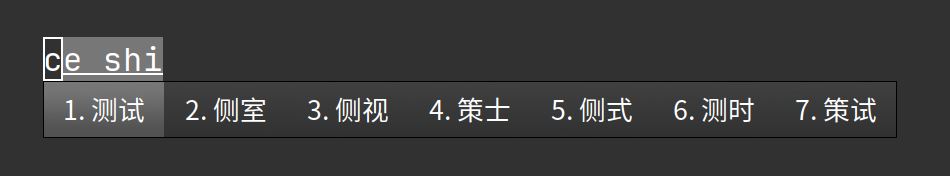
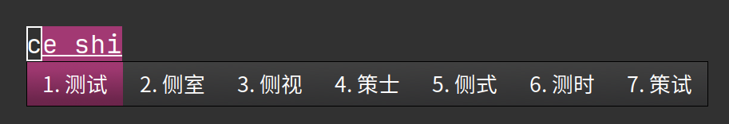
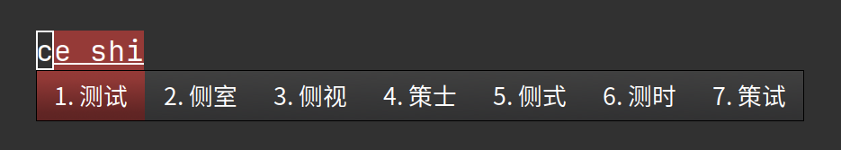
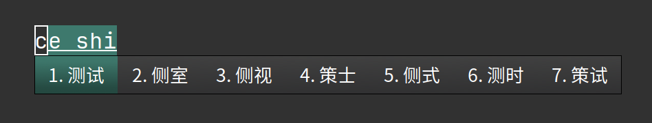

[简体中文](README_zh_CN.md)
# fcitx5-MintX-theme
> MintX style theme for fcitx5
> This theme was modified by [This](https://github.com/thep0y/fcitx5-themes-candlelight)

## Table of contents
- [Effect](#effect)
- [Installation](#installation)
- [Usage](#usage)

## Effect
### Mint-X


### Mint-X-Aqua


### Mint-X-Blue


### Mint-X-Brown

### Mint-X-Grey


### Mint-X-Orange


### Mint-X-Pink


### Mint-X-Purple


### Mint-X-Red


### Mint-X-Sand


### Mint-X-Teal


---

### Mint-X-Dark


### Mint-X-Dark-Aqua


### Mint-X-Dark-Blue


### Mint-X-Dark-Brown


### Mint-X-Dark-Grey


### Mint-X-Dark-Orange


### Mint-X-Dark-Pink


### Mint-X-Dark-Purple


### Mint-X-Dark-Red


### Mint-X-Dark-Sand


### Mint-X-Dark-Teal


## Installation
```shell
# Clone the repository
$ git clone https://github.com/gczcn/fcitx5-MintX-theme.git
$ cd fcitx5-MintX-theme

# Copy all themes (or some of them) to ~/.local/share/fcitx5/themes
$ mkdir ~/.local/share/fcitx5/themes
$ cp themes/* ~/.local/share/fcitx5/themes/
```

## Usage
Just run `fcitx5-config-qt` then open addons/Classic User Interface and select the theme you want
