[English](README.md)
# fcitx5-MintX-theme
> 适用于 fcitx5 的 Mint-X 风格主题  
> 此主题由[这个主题](https://github.com/thep0y/fcitx5-themes-candlelight)修改而成

## 目录
- [安装](#安装)
- [使用](#使用)
- [效果](#效果)

## 安装
```shell
# 克隆仓库
$ git clone https://github.com/gczcn/fcitx5-MintX-theme.git
$ cd fcitx5-MintX-theme

# 复制所有主题（或部分主题）到 ~/.local/share/fcitx5/themes
$ mkdir ~/.local/share/fcitx5/themes
$ cp themes/* ~/.local/share/fcitx5/themes/
```

## 使用
只需在 `fcitx5-config-qt` 中打开 附加组件/addons >> 经典用户界面/Classic User Interface 然后选择需要的主题即可

## 效果
### Mint-X
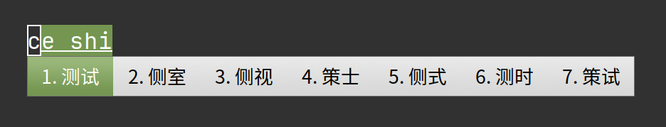

### Mint-X-Aqua
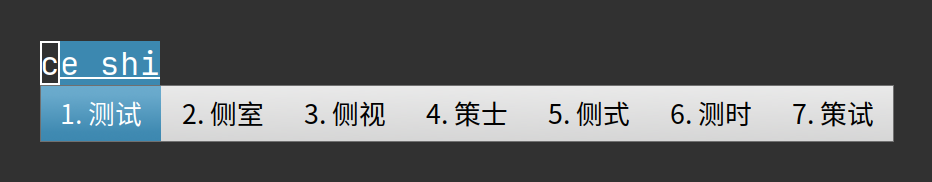

### Mint-X-Blue
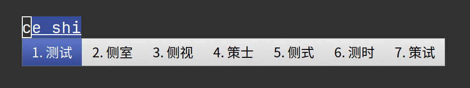

### Mint-X-Brown
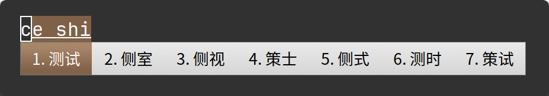

### Mint-X-Grey
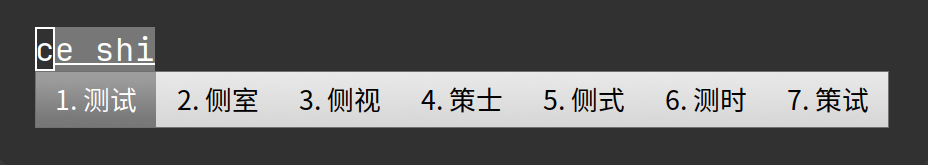

### Mint-X-Orange
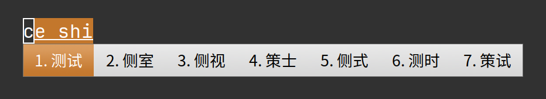

### Mint-X-Pink
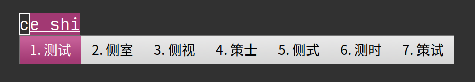

### Mint-X-Purple
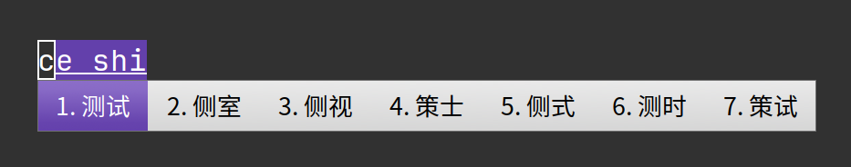

### Mint-X-Red
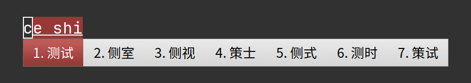

### Mint-X-Sand
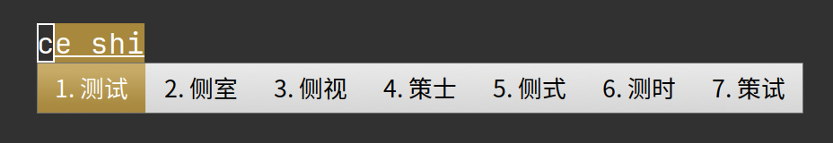

### Mint-X-Teal
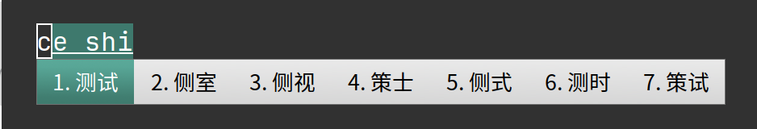

---

### Mint-X-Dark
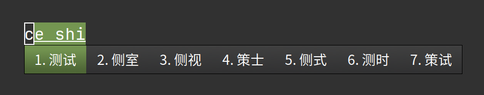

### Mint-X-Dark-Aqua
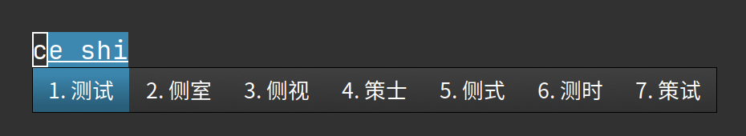

### Mint-X-Dark-Blue
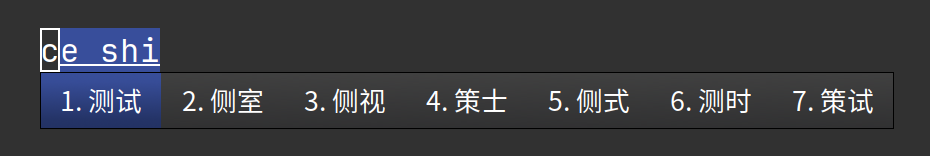

### Mint-X-Dark-Brown
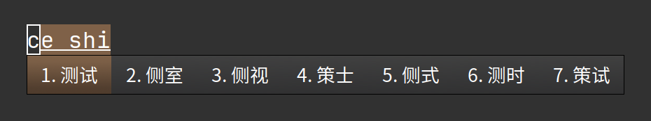

### Mint-X-Dark-Grey
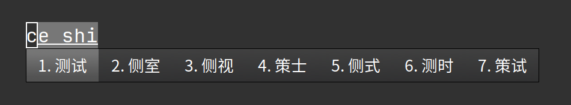

### Mint-X-Dark-Orange
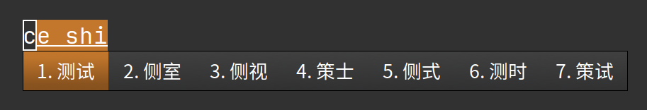

### Mint-X-Dark-Pink
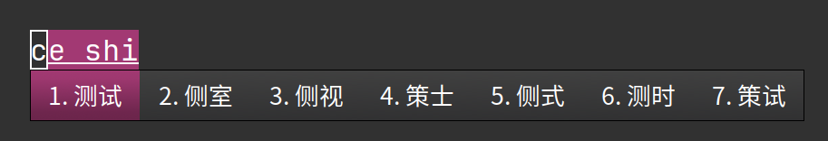

### Mint-X-Dark-Purple
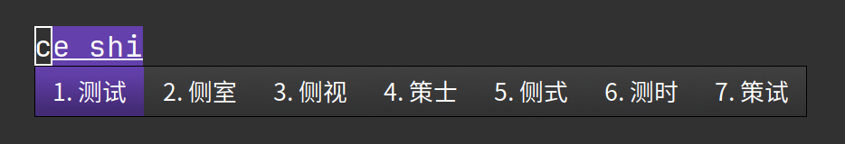

### Mint-X-Dark-Red
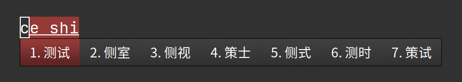

### Mint-X-Dark-Sand
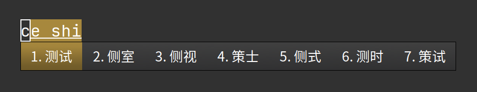

### Mint-X-Dark-Teal
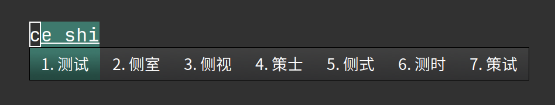
